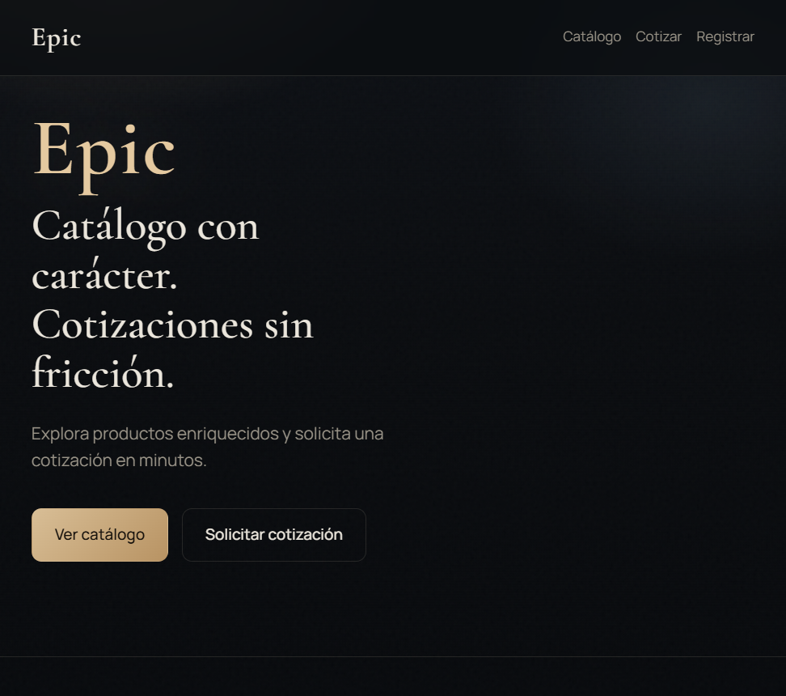
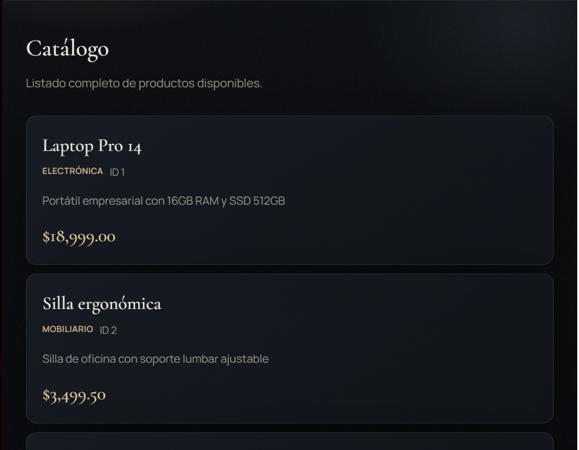
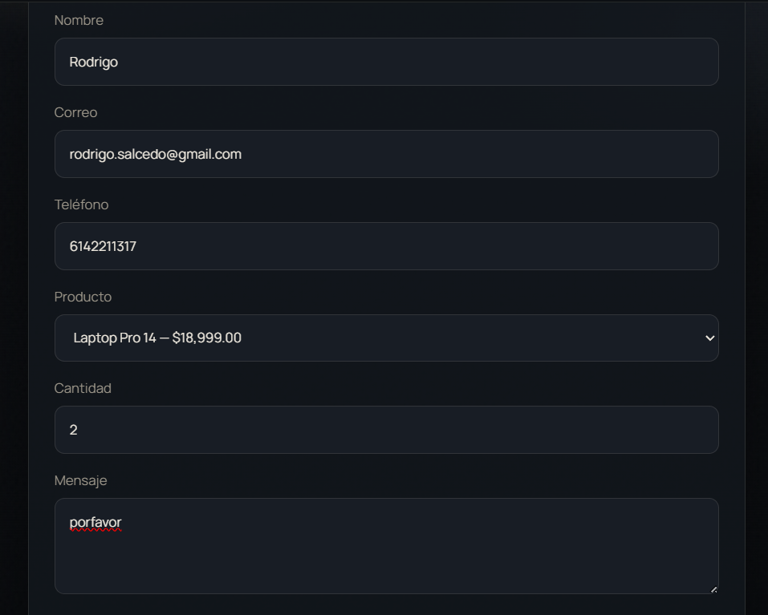
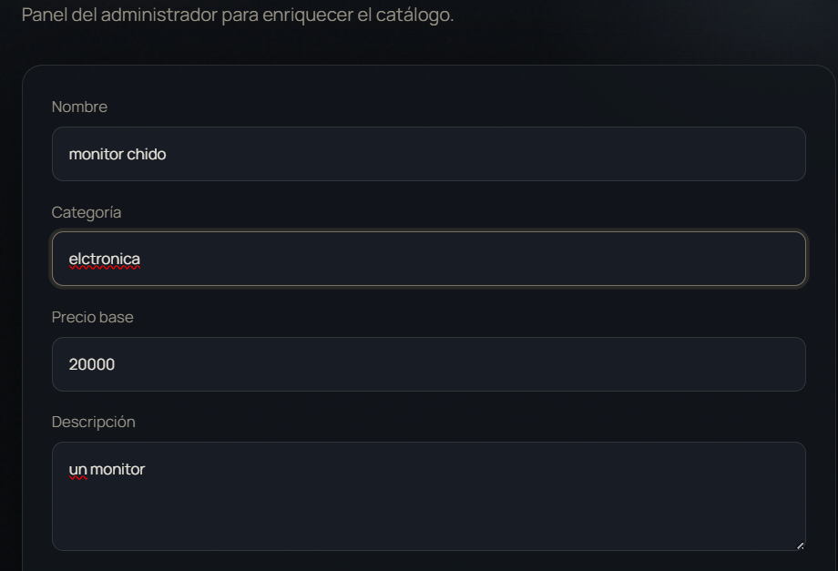

# Epic — Catálogo de Computadoras

Proyecto Spring Boot para mostrar un catálogo de computadoras y registrar solicitudes de cotización.

## Qué hace

1. El administrador registra productos (nombre, descripción, categoría y precio).
2. El cliente ve el listado de productos.
3. El cliente solicita una cotización de un producto.

## Tecnologías

- Java 21
- Spring Boot 4
- Spring Data JPA
- H2 (base de datos en memoria)
- HTML / CSS / JS (interfaz web)

## Cómo correrlo

Necesitas **JDK 21**. En esta máquina puedes usar:

```powershell
$env:JAVA_HOME = "C:\Program Files\Eclipse Adoptium\jdk-21.0.12.101-hotspot"
$env:PATH = "$env:JAVA_HOME\bin;$env:PATH"
.\mvnw.cmd spring-boot:run
```

Luego abre: [http://localhost:8080](http://localhost:8080)

## Estructura del código (simple)

```
src/main/java/com/epic/
├── EpicApplication.java          → Arranca la aplicación
├── common/
│   └── ApiExceptionHandler.java  → Maneja errores de validación
├── product/
│   ├── Product.java              → Entidad (tabla products)
│   ├── ProductRepository.java    → Acceso a la base de datos
│   ├── ProductService.java       → Lógica de negocio
│   └── ProductController.java    → Endpoints REST de productos
└── quotation/
    ├── QuotationRequest.java     → Entidad (tabla quotation_requests)
    ├── QuotationRequestForm.java → Datos que envía el cliente
    ├── QuotationRequestRepository.java
    ├── QuotationRequestService.java
    └── QuotationRequestController.java

src/main/resources/
├── application.properties        → Configuración (puerto, H2, JPA)
├── data.sql                      → Productos de ejemplo al iniciar
└── static/                       → Interfaz web (HTML, CSS, JS)
```

### Flujo básico

```
Navegador / Postman
        ↓
   Controller  → recibe la petición
        ↓
   Service     → aplica la lógica
        ↓
   Repository  → guarda o consulta en H2
```

## Endpoints

### Productos

| Método | URL | Descripción |
|--------|-----|-------------|
| `POST` | `/api/products` | Registrar producto |
| `GET` | `/api/products` | Listar todos |
| `GET` | `/api/products/{id}` | Buscar por id |

Ejemplo para registrar:

```json
{
  "name": "Laptop Air 13",
  "description": "Ultrabook con 16GB RAM y SSD 512GB",
  "category": "Laptop",
  "basePrice": 15999.00
}
```

### Cotizaciones

| Método | URL | Descripción |
|--------|-----|-------------|
| `POST` | `/api/quotations` | Registrar solicitud |
| `GET` | `/api/quotations` | Listar todas |
| `GET` | `/api/quotations/product/{productId}` | Filtrar por producto |

Ejemplo para cotizar:

```json
{
  "clientName": "Ana Pérez",
  "clientEmail": "ana@empresa.com",
  "clientPhone": "5551234567",
  "productId": 1,
  "quantity": 5,
  "message": "Cotización corporativa"
}
```

## Base de datos H2

- Consola: [http://localhost:8080/h2-console](http://localhost:8080/h2-console)
- JDBC URL: `jdbc:h2:mem:epicdb`
- Usuario: `sa`
- Contraseña: *(vacía)*

La base está en memoria: al reiniciar la app se recrea y vuelve a cargar `data.sql`.

## Branches del proyecto

| Branch | Contenido |
|--------|-----------|
| `Dev` | Versión completa |
| `feature/HU1-registrar-productos` | Registrar productos |
| `feature/HU2-listar-productos` | Listar catálogo |
| `feature/HU3-solicitudes-cotizacion` | Solicitudes de cotización |

## Interfaz web

La página en `/` permite:

- Ver el catálogo de computadoras
- Enviar una solicitud de cotización
- Registrar un nuevo producto


## Fotos

### Inicio



### Catálogo




### Cotización




### Registrar producto




